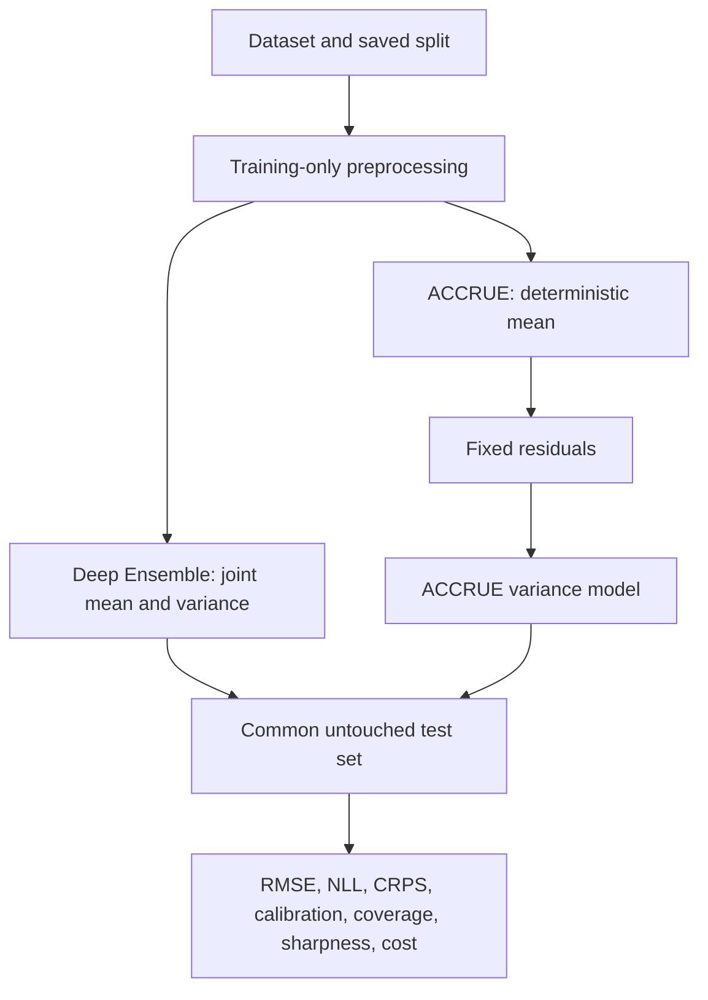

# Repository guide

This guide explains what each tracked part of the repository contributes to the
research project and distinguishes implemented work from planned experiments.

## Top-level files and folders

| Path | Purpose |
|---|---|
| `README.md` | Project overview, experimental stages, reproducibility rules and commands. |
| `pyproject.toml` | Python package metadata, dependencies, test settings and command-line entry points. |
| `.gitignore` | Prevents environments, caches, downloaded datasets and generated results from entering Git. |
| `configs/` | Human-readable experiment settings taken from the papers. |
| `docs/` | Research protocol, paper-to-code decisions and this repository guide. |
| `src/uqcomparison/` | Reusable implementation of datasets, metrics, models and experiments. |
| `tests/` | Small checks for equations, generators and model behaviour. |
| `results/` | Local generated tables and plots. Its contents are ignored except `.gitkeep`. |

## Configuration

### `configs/paper_reproduction.yaml`

Records the intended paper settings in one place: five Deep Ensemble members,
the one-hidden-layer benchmark network, 40 epochs, ACCRUE's 50/10 uncertainty
network, five restarts, toy sample sizes and split fractions. It is currently a
protocol record; later experiment runners will load it directly.

## Data layer

### `src/uqcomparison/data/synthetic.py`

Implements the four exact synthetic definitions printed in the ACCRUE paper:

- G: sinusoidal mean and linearly increasing noise.
- Y: nonlinear mean and periodic heteroscedastic noise.
- W: oscillatory mean and strongly varying noise.
- 5D: zero mean and a five-dimensional noise surface.

`generate_synthetic` samples observations, while `synthetic_truth` returns the
known mean and standard deviation. Keeping both lets us measure whether a model
recovers the hidden uncertainty rather than only whether it predicts `y`.

## Metric layer

### `src/uqcomparison/metrics/probabilistic.py`

Contains metrics shared by both methods:

- RMSE and MAE for point predictions.
- Gaussian NLL and CRPS for the complete predictive distribution.
- PIT/reliability calibration error.
- Prediction-interval coverage.

### `src/uqcomparison/metrics/accrue.py`

Implements ACCRUE's equations in NumPy:

- analytic Gaussian CRPS values;
- analytic reliability score from Eq. (8);
- the paper's heuristic `beta` weighting;
- the combined ACCRUE objective.

This implementation is independent of PyTorch and is used by the paper-style
polynomial reproduction.

## Model layer

### `src/uqcomparison/models/deep_ensemble.py`

Implements the regression Deep Ensemble:

1. Each network outputs a mean and positive variance.
2. Each member minimizes Gaussian NLL.
3. Members use different initializations and minibatch orders, but all see the
   full training data.
4. Predictive mean and variance are combined using the paper's moment-matching
   equation.

This file requires PyTorch. The implementation exists, but the original UCI
benchmark table has not yet been run.

### `src/uqcomparison/models/accrue.py`

Implements the neural ACCRUE variance estimator in PyTorch. Its input is `x` and
fixed residuals from a separately trained mean model. It contains the 50/10
variance network, CRPS, reliability score, combined loss and quasi-Newton-style
LBFGS fitting with five restart support.

The neural core exists, but G/Y/W/5D and real-data neural reproduction runs are
still pending in a PyTorch environment.

### `src/uqcomparison/models/accrue_polynomial.py`

Implements Algorithm 1 from the ACCRUE paper for its one-dimensional toy
datasets. It increases polynomial order, warm-starts the next optimization and
stops when the ACCRUE-score improvement is small. Positivity is checked across
the known domain because a Gaussian standard deviation cannot be negative.

## Experiment layer

### `src/uqcomparison/experiments/reproduce_toys.py`

Starter runner that can train both neural methods on a selected synthetic
dataset. It is useful as a quick integration check, but is not yet the final
fair-comparison pipeline.

### `src/uqcomparison/experiments/reproduce_accrue_toys.py`

Completed first paper reproduction runner for ACCRUE G/Y/W polynomial tests:

1. Generate 100 observations.
2. Make a 33/33/34 train/validation/test split.
3. Fit the paper's homoskedastic Gaussian-process mean oracle.
4. Fit polynomial `sigma(x)` using ACCRUE on training residuals.
5. Evaluate only on test rows.
6. Repeat independently (100 runs by default).
7. Save per-run metrics, aggregate summary, recovery plot and reliability plot.

Run it with:

```bash
uq-reproduce-accrue --dataset g --runs 100
```

## Tests

| File | Checks |
|---|---|
| `tests/test_synthetic.py` | Generator sizes, positive true sigma and deterministic seeding. |
| `tests/test_metrics.py` | Known values and validity rules for common Gaussian metrics. |
| `tests/test_accrue.py` | Finite ACCRUE score and positive polynomial uncertainty predictions. |

## Current research status

Completed:

- clean package and experiment structure;
- exact synthetic generators;
- shared regression-UQ metrics;
- Deep Ensemble and neural ACCRUE cores;
- ACCRUE polynomial Algorithm 1;
- 100-run G polynomial reproduction with saved local outputs;
- 11 passing tests.

Not yet completed:

- neural ACCRUE reproduction on G/Y/W/5D;
- Y, W and 5D final reproduction outputs;
- Deep Ensemble original UCI benchmark table;
- ACCRUE real-world benchmark table;
- identical-split head-to-head comparison;
- three new scientific datasets.

## Intended data flow


